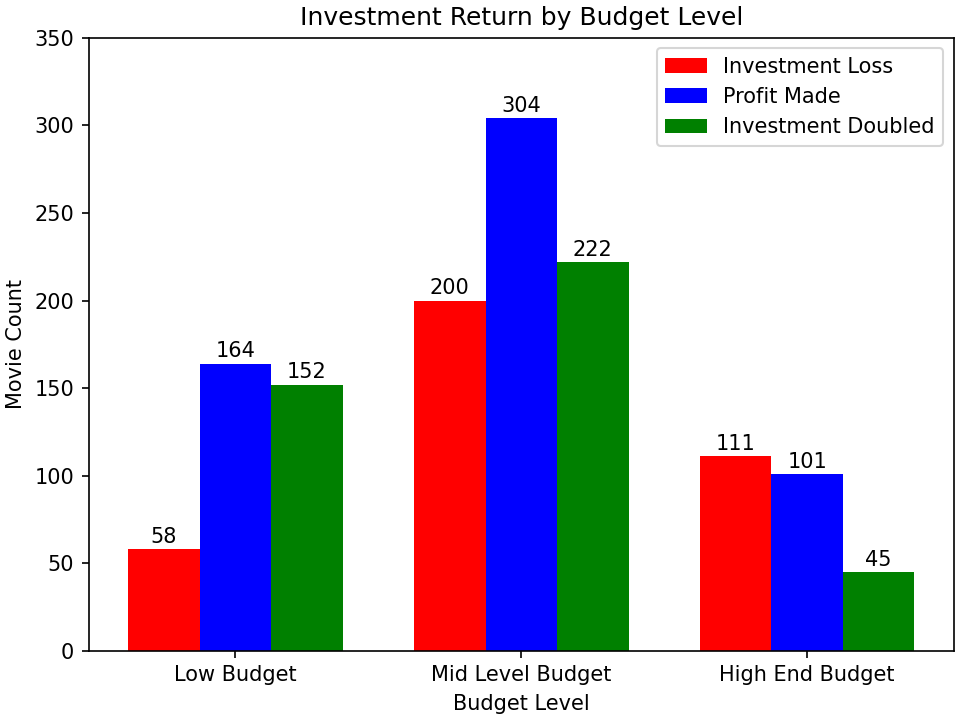

# Movie Data Analaysis

Author: [Andrew Reusche](https://www.linkedin.com/in/andrew-reusche-1397bb311/)

## Project Overview

For over 100 years, countless movies have been produced and released, making them not only a staple of the American pastime but also a proven business venture that can return great profits if executed properly. However, what may have made a movie a successful investment years ago, may not be in line with the modern-day market. To help solve for that, this project uses Exploratory Data Analysis (E.D.A.)to highlight some attributes that modern successful films have had, in an effort to help guide those new to movie production.

## Business Problem

My company recognizes that more large organizations are branching into the movie production business with mixed results in terms of investment success. Now our company too would like a share in the market, and they plan to achieve this through opening their own movie production studio, but currently do not know anything about creating movies, or what makes them successful in the modern market. To help guide the head of our company's new movie studio, I will use E.D.A. on existing movie data to generate insights into attributes that are commonly present in modern successful movies. The studio head can then use these insights to help decide factors that could make this new movie venture successful.

## Data Understanding

To compile relevant information for this analysis, I drew and combined data from two of the largest and most well-known reputable movie information hubs: [IMDB.com] (https://www.imdb.com/), and [The-Numbers.com] (https://www.the-numbers.com/). These combined databases contain information on 139,457 movies from 1915 up to 2020, with each record including information on many factors such as their earnings, staff, and ratings.

Due to these datasets not including a complete list of all the details and factors that went into making and releasing these movies, we can only outline some factors that were commonly present in modern profitable movies instead of claiming the outright cause of success.

In this E.D.A., we will specifically be focussing a subset of this merged data, detailing movie production budget level, genre, and release date in relation to the domestic profitability of the 938 different movies released between 2015 and 2020. All three of these attributes can have highly variable options but are also factors that any new studio should easily be able to control when trying to make their first movie.

Narrowing the scope of movies we analyze down to only ones that were released in 2015 and later helps us focus more on what the current market trends are saying. Without this scope narrowing, the trend results may be skewed by what was popular 20 or 50+ years ago. Additionally, this scope could be altered to show movies released during any time period, to help represent the trends for that era.

As for why we will be focussing on domestic gross profits over worldwide gross profits, this movie studio is a new venture for our company, and as such it is important to keep goals manageable and obtainable. A solid marker that this new venture is moving in the right direction would be to first have local success, and then if we want to scale the operation up we can shift to the global market afterward.

## Methods

This project uses Data Cleaning, Feature Engineering, and Descriptive Analysis to highlight key characteristics commonly found in 2015 - 2020 era movies found in the merged IMDB and The-Numbers movies datasets.

## Results

From the graph below we can see that even though the Mid Level Budget (5,000,000 to 50,000,000 dollars) is the most frequently used budget level from 2015-2020, the movies that used a Low Budget production budget (under 5,000,000 dollars) expierienced the lowest ratio of investment losses and the highest ratio of the production investment returning at least double it's amount in the domestic market.

Here we can see that Drama movies tend to be the most common kind of movie released in the 2015-2020 market, however, the amount of times Drama movies experience an investment loss in the Domestic market is just about even with the amount of times their profits double their investments. Alternatively, Horror movies seem to have a significantly lower ratio of movies that resulted in an investment loss, and a lot higher ratio of movies that resulted in earnings at least double what the production budget investment was.

Here we see that the amount of unsuccessful movies (or movies that resulted in an production budget investment loss) are somewhat uniform throughout the entire year. However, only the Winter Season (from December - February) has both a significantly higher amount of movies that made a profit in the domestic market, and movies that doubled their investment.

## Business Suggestions

This analysis resulted in 3 recommendations that our new movie studio director can use to help guide this new business venture. Implementing these recommendations into the criteria for producing and launching a new movie in the modern domestic market could help minimize the risk of undesirable results such as an investment loss.

1) This is a new movie production, studio so starting out with a lower-level movie production budget under $5,000,000 could be the safest and most sensible option. From 2015 - 2020, compared to higher budget levels, the movies released at this budget level experienced the lowest percentage of investment losses and the highest percentage of at least doubling their investment. Additionally, if the movie is not a success the amount of money lost would be relatively limited compared to what would be at stake if a higher budget was used.

2) In the same spirit of minimizing the risk of a project failure and maximizing the chance of success, I would suggest making a Horror movie. From 2015 - 2020, movies in the Horror genre experienced both the lowest amount of investment losses and the highest amounts of investments doubling in returns when compared to the overall amount of movies released for a genre. Horror movies also can pair nicely with lower production budget levels.

3) Based on this analysis I would suggest launching the movie to the public during one of the winter months (December, January, February). In the graph, we can see that from 2015 - 2020, even though the number of movies launched resulting in an investment loss was relatively even throughout the year, there was a significant spike in movies where profits were made and especially a significant upward deviation from the general level of investments doubled throughout the year during these winter months.

Following these suggestions could allow us to break into the market with a minimized risk, more easily controlled losses, and entry at a lower price point. Additionally, once we have a solid footing in the market and have gained experience and recognition we could expand out to global markets, more lavish productions, and other genres.

## Next Steps

Additional analysis could help further minimize investment risk, and highlight what is currently popular and profitable in the movie market. Three future analyses could be:

1) Actor Analysis: Given more data about different actors, this analysis could help narrow down who the current popular actors are, or the actors that cause the biggest spike in ticket sales when put in a movie.

2) Marketing Technique Analysis: Given more data about different marketing techniques, this could shed light on what the most effective current strategies are, and what it would take to roll them out.

3) Global Market Analysis: Given more data about the global market this could help predict what types of movies and attributes of movies would be successful in other countries around the world, increasing our market share.

## For More Information

See the full analysis in the [Jupyter Notebook](Movie_Analysis.ipynb), and review this [presentation](Presentation1.pdf) 

For additional information contact Andrew John Reusche at a.j.reusche@gmail.com

## Repository Structure

├── data

├── images

├── .gitignore

├── Exploratory_Data_Analysis.ipynb

├── Movie_Analysis.ipynb

├── Movie_Analysis.pdf

├── Presentation_Movie_Analysis.pdf

└── README.md
